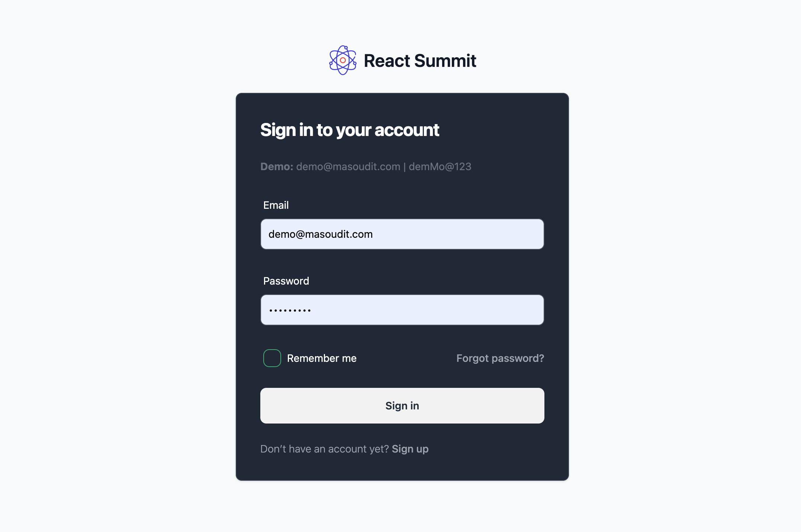

### intro REACT SUMMIT PROJECT
React Summit one the best solution and boilerplate for Frontend Application on 2024.
React Summit is meticulously crafted to deliver an exceptional user experience with a focus on efficiency, maintainability, and modern design principles. 
The following features and technologies have been strategically incorporated to ensure a robust and high-quality application.

### Pre requirements
- node v18.17.0

### Setup
- yarn install
- yarn start

note: Due to the utilization of the MockAPI (MSW Package), testing is exclusively available in development mode. Please conduct testing using the "yarn start" command.
note: If there are delays during the setup process, consider removing the Cypress package.

### Setup Test
- yarn test:e2e

### Hot Features And Technology
- Webpack 5: base config project no CRA
- Typescript
- TAILWIND: Layout and Structure CSS Project
- DaisyUi: System design
- Zustand: state management
- ReactJS 18
- React Router V6
- Cypress E2E Test
- MSW For MOCK API
- Webpack Bundle Analyzer

### Why we choose these ?
    - Webpack 5:
        Description: Efficient project configuration without Create React App (CRA), leveraging Webpack 5 for fine-tuned control.

    - TAILWIND CSS:
        Description: Project styling structured with TAILWIND CSS, offering utility-first principles for rapid and lightweight development.

    - DaisyUI:
        Description: Streamlined component design with DaisyUI, providing pre-designed, customizable components for a consistent UI.
                     Best integration and matching by Tailwind.

    - Zustand:
        Description: Lightweight state management using Zustand for simplified state manipulation within the React app.
                     In comparison by Redux, Zustand is small, and simple application. Good choice for small App.

    - ReactJS 18:
        Description: Developed with ReactJS 18, incorporating features like concurrent rendering and automatic batching for enhanced user experience.

    - React Router V6:
        Description: Efficient client-side navigation achieved through React Router V6, offering improved capabilities and a declarative API.

    - Cypress E2E Test:
        Description: Robust end-to-end testing with Cypress, ensuring application reliability and providing a real browser environment.

    - MSW Mock API:
        Description: MSW used for creating a mock API, facilitating early testing and independent development between frontend and backend teams.
                     Behind ideas is running a service worker and mocking API.
    
    - Webpack Bundle Analyzer:
        Description: Analyze realtime bundle size project production and development
                     Gzip, Parsed, Develop

### E2E TESTS (cypress)
- check login page completely loaded passed
- check login button reachable on mobile view passed
- check protected url passed
- check not define url return 404 passed
- check validation on register page passed
- check validation on login page passed
- check user redirected after login passed
- check list of articles loaded completely passed
- check dialog confirm remove shown passed
- check open add new Article work truly